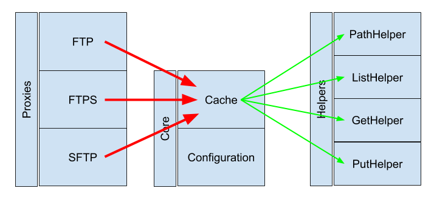

# Ftpmock

Test your FTP calls offline.

## Status

| Is It Working? | Is It Tested? | Code Quality | **# of Downloads** |  **Get Involved!** |
|:---|:---|:---|:---|:---|
| [](https://travis-ci.org/thejamespinto/ftpmock) | [](https://codeclimate.com/github/thejamespinto/ftpmock/test_coverage) | [](https://codeclimate.com/github/thejamespinto/ftpmock/maintainability) | [](https://rubygems.org/gems/ftpmock) | [](https://github.com/thejamespinto/ftpmock/issues) |

## Compatibility

| <image width=16 src='./images/ruby.png'> Ruby 2.3 | <image width=16 src='./images/ruby.png'> Ruby 2.4  | <image width=16 src='./images/ruby.png'> Ruby 2.5 | <image width=16 src='./images/ruby.png'> Ruby 2.6 | <image width=16 src='./images/ruby.png'> Ruby 2.7 |
| :--- | :--- | :--- | :--- | :--- |

## Installation

Add this line to your application's Gemfile:

```ruby
group :test do
  gem 'ftpmock'
end
```

## Usage

If you know your way around tests

```ruby
require 'ftpmock'

RSpec.configure do |config|
  config.around(:example) do |example|
    Ftpmock.on! do
      example.run
    end
  end
end
```

If you need to see a full example

```ruby
require 'rubygems'
require 'test/unit'
require 'ftpmock'

# Optional (default values)
Ftpmock.configure do |c|
  c.path = 'test/ftp_records'
  c.verbose = true
end

class FtpmockTest < Test::Unit::TestCase
  def test_ubuntu_mirror
    Ftpmock.on! do
      # Ubuntu Download - University of Pittsburgh
      ftp = Net::FTP.new
      assert_equal(Ftpmock::NetFtpProxy, ftp.class)
      assert ftp.connect('mirror.cs.pitt.edu', 21)
      assert ftp.login('', '')

      t = Time.now
      3.times do |i|
        list = ftp.list('/ubuntu/releases')
        assert list.size.positive?

        ftp.get('/ubuntu/releases/robots.txt', 'tmp/ubuntu_robots.txt')
        assert File.exist?('tmp/ubuntu_robots.txt')

        puts "[Take #{i+1}] #{(Time.now-t).round(3)}s"
      end
    end
  end
end
```

Run this test once, and Ftpmock will record the FTP requests to __test/ftp\_records/mirror-cs-pitt-edu\_21\_\_/__

Run it again, and Ftpmock will replay the responses from __mirror.cs.pitt.edu__ when the FTP request is made.

Your tests are now blazing fast because no real FTP requests are made anymore.

The test will continue to pass, even if you are offline, or if the University of Pittsburgh FTP servers are down for maintenance.

The responses will be accurate since they will contain the same list and files you get from a real request.

Unlike VCR, Ftpmock combines your four credentials _(address + port + username + password)_ and caches onto the exact same directory, optimizing for both storage and readability.

## Development

After checking out the repo, run `bin/setup` to install dependencies.

Then, run `bundle exec rake spec` to run the tests.

You can also run `bin/console` for an interactive prompt that will allow you to experiment.

To install this gem onto your local machine, run `bundle exec rake install`.

## Documentation



- Core
    - [x] Stubber
    - [x] Configuration
    - [x] Cache
    - [x] Helpers
- Proxies
    - [x] Proxy for Ruby's native Net::FTP library
    - [ ] Proxy for Jamis Buck's gem 'net-sftp'

### Core instantiable classes & procedural modules

links: [lib/ftpmock/core](./lib/ftpmock/core)

- [x] stubber for proxies
- [x] configuration class
- [x] cache class
- [x] cache path helper
- [x] cache list helper
- [x] cache get helper
- [x] cache put helper

### Proxy for Ruby's native Net::FTP library (Ftpmock::NetFtpProxy)

links: [lib/ftpmock/proxies/net_ftp_proxy.rb](./lib/ftpmock/proxies/net_ftp_proxy.rb) , https://apidock.com/ruby/Net/FTP & https://github.com/ruby/ruby/tree/master/lib/net

- [x] proxy class
- [x] stubbers
- [x] address & port forwarding
- [x] username & password forwarding
- [x] chdir forwarding
- [x] pwd
- [x] list
- [x] get
- [x] put
- [ ] ssl support
- [x] unit tests
- [x] integration tests

### Proxy for Jamis Buck's gem 'net-sftp' (Ftpmock::NetSftpProxy)

links: [lib/ftpmock/proxies/net_sftp_proxy.rb](./lib/ftpmock/proxies/net_sftp_proxy.rb) , https://rubygems.org/gems/net-sftp & https://github.com/net-ssh/net-sftp

- [x] proxy class
- [x] stubbers
- [ ] address & port forwarding
- [ ] username & password forwarding
- [ ] list
- [ ] get
- [ ] put
- [ ] unit tests
- [ ] integration tests

## Contributing

Bug reports and pull requests are welcome on GitHub at https://github.com/thejamespinto/ftpmock.

Changelog can be found at [CHANGELOG.md](./CHANGELOG.md)

## License

The gem is available as open source under the terms of the [MIT License](https://opensource.org/licenses/MIT).
